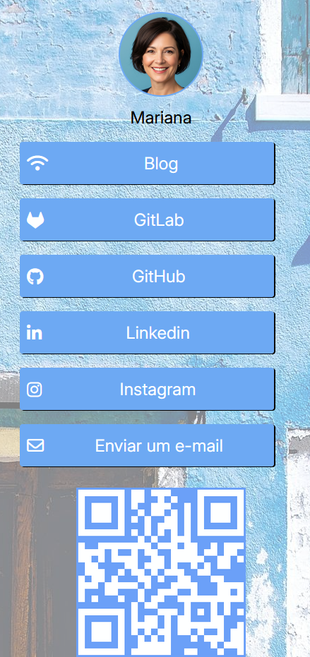

# LinkTree Dinâmico

Este é um projeto simples de "LinkTree" dinâmico, construído com tecnologias web modernas, que permite exibir informações de perfil e links de redes sociais de diferentes usuários com base em um ID fornecido na URL.



```json
"usuarios": [
    {
      "id": "1",
      "nome": "Felipe",
      "perfil": "../public/perfil1.png",
      "fundo": "../public/greenthema.jpg",
      "botaoCor": "#3AB74D",
      "qrcode": "../public/greenqr.png",
      "links": [
        { "id": "7381", "tipo": "Blog", "url": "https://blog-do-felipe-abc123.com.br" },
        { "id": "1945", "tipo": "GitLab", "url": "https://gitlab.com/felipe-def456" },
        { "id": "6209", "tipo": "GitHub", "url": "https://github.com/felipe-ghi789" },
        { "id": "3572", "tipo": "Linkedin", "url": "https://linkedin.com/in/felipe-jkl0" },
        { "id": "8814", "tipo": "Instagram", "url": "https://instagram.com/felipe.mno1" },
        { "id": "4027", "tipo": "E-mail", "url": "mailto:felipe.pqr2@example.com" }
      ]
    }
```


## 🚀 Tecnologias Utilizadas

* **TypeScript**: Superconjunto de JavaScript que adiciona tipagem estática, garantindo maior robustez e manutenibilidade ao código.
* **JavaScript (ESNext)**: Utilização de funcionalidades modernas da linguagem para manipulação do DOM e requisições assíncronas (`fetch`).
* **HTML**: Estrutura base da página web, onde o conteúdo é renderizado dinamicamente.
* **CSS**: Estilização da interface do usuário para proporcionar um design atraente e responsivo.
* **JSON**: Formato para armazenamento e consumo dos dados de perfil dos usuários, incluindo informações como nome, foto, links e cores personalizadas.
* **API Fetch**: Para realizar requisições HTTP e buscar os dados dos usuários de um endpoint local.
* **Font Awesome**: Biblioteca de ícones utilizada para enriquecer visualmente os links e informações de perfil.

## ✨ Funcionalidades

* Exibição de foto de perfil e nome do usuário.
* Lista de links clicáveis para diversas plataformas (Blog, GitLab, GitHub, LinkedIn, Instagram, E-mail).
* Personalização de fundo e cores de botões baseada nos dados do usuário.
* Exibição de um QR Code para o perfil do usuário.
* Carregamento dinâmico de informações do usuário através de um parâmetro de ID na URL.


* `dados.json`: Contém um array de objetos `usuarios`, onde cada objeto representa um perfil e suas respectivas informações (ID, nome, perfil, fundo, corFundo, botaoCor, qrcode, links).
* `index.html`: A página HTML principal que carrega o script JavaScript e o CSS.
* O arquivo `.ts` (não mostrado no snippet, mas implícito pelo `tsconfig.json`) seria o responsável pela lógica de buscar os dados e renderizar o conteúdo dinamicamente no `index.html`.

## ⚙️ Como Executar o Projeto Localmente

Para configurar e executar este projeto em sua máquina local, siga os passos abaixo:

1.  **Clone o repositório:**

    ```bash
    git clone <URL_DO_SEU_REPOSITORIO>
    cd linktree-dinamico # ou o nome da pasta do seu projeto
    ```

2.  **Instale as dependências:**
    Certifique-se de ter o [Node.js](https://nodejs.org/) e o [npm](https://www.npmjs.com/) (ou [yarn](https://yarnpkg.com/)) instalados.

    ```bash
    npm install
    # ou
    yarn install
    ```

3.  **Configure o servidor de dados (Mock API):**
    Este projeto espera que haja um servidor rodando em `http://localhost:3000/usuarios/` que retorne os dados do `dados.json`. Uma maneira simples de simular isso é usando o `json-server`.

    * Instale o `json-server` globalmente:
        ```bash
        npm install -g json-server
        ```
    * Inicie o `json-server`:
        ```bash
        npm run server
        ```
        Isso criará um endpoint `http://localhost:3000/usuarios` que servirá os dados do seu arquivo `dados.json`.

4.  **Inicie a aplicação web:**
    Este projeto provavelmente utiliza uma ferramenta de bundler (como Webpack ou Vite) configurada no `package.json` para iniciar o servidor de desenvolvimento.

    * Verifique os scripts definidos no seu `package.json` para o comando de inicialização. Geralmente é algo como:
        ```bash
        npm run dev
        # ou
        npm start
        # ou
        yarn dev
        ```

5.  **Acesse a aplicação:**
    Após iniciar o servidor de desenvolvimento e o `json-server`, abra seu navegador e acesse a URL da aplicação, passando o ID do usuário como parâmetro.

    Exemplos:
    * `http://localhost:XXXX/?id=1` (para Felipe)
    * `http://localhost:XXXX/?id=2` (para Mariana)
    * `http://localhost:XXXX/?id=3` (para Carlos)

    (Substitua `XXXX` pela porta em que sua aplicação web está rodando, que será exibida no terminal após executar o comando de inicialização.)

## 📝 Como Adicionar Novos Usuários

Para adicionar um novo usuário ao seu LinkTree, siga estes passos:

1.  Abra o arquivo `dados.json`.
2.  Adicione um novo objeto JSON dentro do array `usuarios`, seguindo a mesma estrutura dos usuários existentes. Certifique-se de que o `id` seja único e sequencial.

    ```json
    {
        "id": "4",
        "nome": "Novo Usuário",
        "perfil": "./public/perfil4.png",
        "fundo": "./public/novotema.jpg",
        "botaoCor": "#ABCDEF",
        "qrcode": "./public/qrcode4.png",
        "links": [
            { "id": "6001", "tipo": "Website", "url": "[https://www.novousuario.com](https://www.novousuario.com)" },
            { "id": "6002", "tipo": "Twitter", "url": "[https://twitter.com/novousuario](https://twitter.com/novousuario)" }
            // ... adicione mais links conforme necessário
        ]
    }
    ```

3.  Certifique-se de que os caminhos para `perfil`, `fundo` e `qrcode` estejam corretos e que as imagens existam na pasta `public/`.
